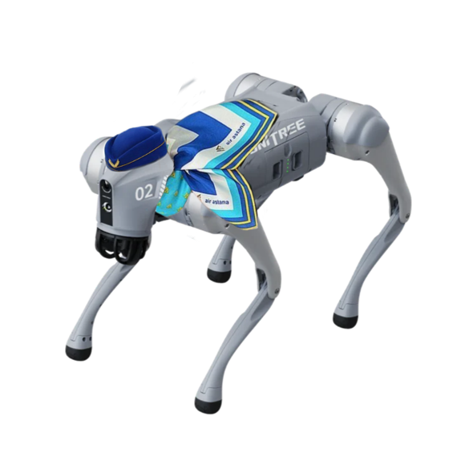

# Dogsteska

Dogsteska je projekt zaměřený na vývoj autonomního systému pro navigaci psa v prostoru, detekci překážek a skenování lístků pomocí kamery. Tento projekt je vyvíjen na modelu Unitree Go2¨



# Funkcionality

## 1. Chůze
Pes je schopen dojít na zadané souřadnice, které mu určíme.

## 2. Skenování lístků
- Kamera naskenuje objekty před sebou.
- Pokud se jedná o čárový kód, vrátí jeho číselnou hodnotu.

## 3. Detekce překážek
- Identifikace objektů, které se nacházejí v cestě psa.
- Reakce na překážky a úprava trasy.

## 4. Mapování prostoru
- Použití statické mapy s předdefinovanými body, kam se má pes dostat.
- Body jsou označeny čísly pro snadnější navigaci.

## 5. Testování
- Ověření funkcionality navigace, skenování a detekce překážek.
- Simulace různých scénářů pohybu psa.

# Instalace prostředí a spuštění

Tento návod popisuje postup instalace vývojového prostředí pro simulace s Unitree roboty v prostředí MuJoCo, včetně potřebných závislostí a konfigurace systému. Cílem je vytvořit funkční prostředí pod Windows pomocí WSL (Windows Subsystem for Linux).


---

## 📋 Požadavky

Před samotnou instalací je třeba mít připravené následující nástroje a komponenty:

- 🏠 **WSL (Windows Subsystem for Linux)** – doporučujeme použít WSL2 pro lepší výkon.
- 🐧 **Ubuntu 22.04 LTS** – spolehlivá distribuce pro vývoj v Linuxovém prostředí.
- 🐍 **Python 3, pip a virtualenv** – pro správu závislostí a izolaci vývojového prostředí.
- ⚙️ **Knihovny: `unitree_sdk2py`, `mujoco`, `pygame`** – základní balíčky pro práci se simulací.
- 🖼️ **OpenGL + VcXsrv** – pro zajištění vykreslování grafiky z WSL do prostředí Windows.
- 🌐 **Git + repozitář `unitree_mujoco`** – obsahuje samotné demonstrační prostředí.

---

## 1. Instalace WSL a Ubuntu 22.04

Nejprve nainstalujte WSL a požadovanou verzi Ubuntu. Ve Windows spusťte PowerShell jako správce a zadejte:

```powershell
wsl --install
wsl --install -d Ubuntu-22.04
```

Po instalaci spusťte Ubuntu:

```powershell
wsl
```

---

## 2. Instalace Pythonu a vytvoření virtuálního prostředí

Aktualizujte balíčky a nainstalujte potřebné nástroje:

```bash
sudo apt update && sudo apt install python3 python3-pip python3-venv -y
```

Vytvořte a aktivujte virtuální prostředí:

```bash
python3 -m venv unitree_env
source unitree_env/bin/activate
```

---

## 3. Instalace nezbytných Python balíčků

Nainstalujte SDK od Unitree, knihovnu MuJoCo a pygame:

```bash
pip install unitree_sdk2py mujoco pygame
```

Získání repozitáře:

```bash
git clone https://github.com/unitreerobotics/unitree_mujoco
cd unitree_mujoco
```

---

## 4. Instalace OpenGL a nastavení grafického výstupu

Pro vykreslování grafiky v rámci WSL je třeba nainstalovat OpenGL knihovny:

```bash
sudo apt install mesa-utils libglu1-mesa-dev freeglut3-dev mesa-common-dev -y
```

Na Windows nainstalujte **VcXsrv** z následujícího odkazu:  
👉 [https://sourceforge.net/projects/vcxsrv/](Stáhnout VcXsrv)

Při spuštění zvolte volbu **Disable Access Control**.

Následně v Ubuntu nastavte proměnnou prostředí `DISPLAY`. Nejprve zjistěte IP adresu svého zařízení ve Windows pomocí:

```powershell
ipconfig
```

Najděte položku `IPv4 Address` a zadejte ji v Ubuntu:

```bash
export DISPLAY=<TVÁ_WINDOWS_IP>:0
```

Např.:

```bash
export DISPLAY=192.168.0.123:0
```

---

Po dokončení všech kroků by mělo být prostředí připravené pro spuštění simulací. Doporučuje se spouštět testovací skripty z repozitáře `unitree_mujoco` a ověřit, že vše funguje správně.

## 5. Spuštění
```bash
python main.py <pripadny_interface>
```

# Technologie
- Python
- OpenCV (pro skenování lístků)
- Unitree Go2 (hardware pro testování)
